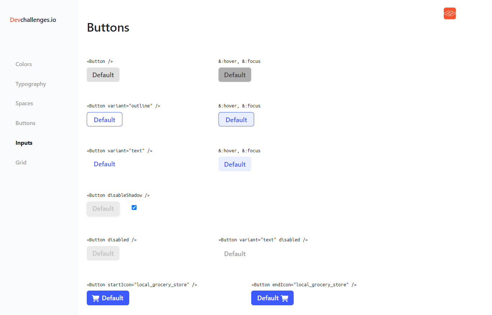
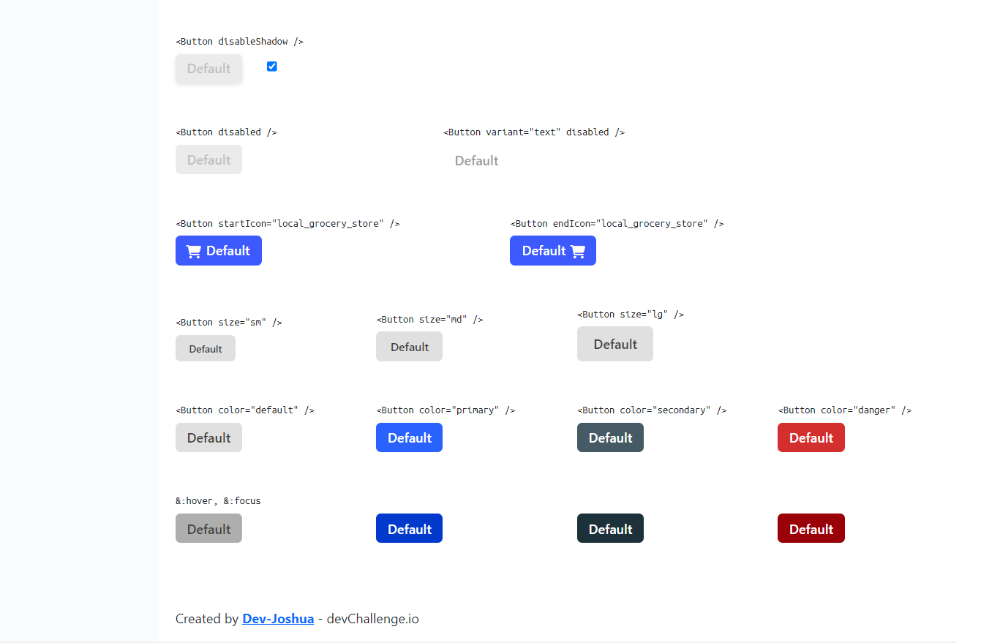

<!-- Please update value in the {}  -->

<h1 align="start">Buttons App</h1>

<div align="center">
   Solution for a challenge from  <a href="http://devchallenges.io" target="_blank">Devchallenges.io</a>.
</div>

<div align="center">
  <h3>
    <a href="https://github.com/Dev-Joshua/button-app">
      Demo
    </a>
    <span> | </span>
    <a href="https://github.com/Dev-Joshua/button-app">
      Solution
    </a>
    <span> | </span>
    <a href="https://devchallenges.io/challenges/ohgVTyJCbm5OZyTB2gNY">
      Challenge
    </a>
  </h3>
</div>

<!-- TABLE OF CONTENTS -->

## Table of Contents

- [Table of Contents](#table-of-contents)
- [Overview](#overview)
  - [Built With](#built-with)
- [Features](#features)
- [How To Use](#how-to-use)
- [Contact](#contact)

<!-- OVERVIEW -->

## Overview

Interface skeleton:


ButtonApp finished:



In this project I worked with some features of Angular like:

- Communication between components.
- Using Bootstrap.
- CSS and SCSS structure.
- Using the @input decorator I can modify the button properties from the buttons-container component and thus control the state of the button.
- Using the 'ngClass' directive to dynamically apply classes to the button component.
- Using the properties of the button component I apply different states as the case may be

### Built With

<!-- This section should list any major frameworks that you built your project using. Here are a few examples.-->

- [Angular](https://angular.io/)
- [TypeScript](https://www.typescriptlang.org/)
- [HTML](https://developer.mozilla.org/es/docs/Web/HTML)
- [SASS](https://sass-lang.com/)
- [Bootstrap](https://getbootstrap.com/)

## Features

<!-- List the features of your application or follow the template. Don't share the figma file here :) -->

This application/site was created as a submission to a [DevChallenges](https://devchallenges.io/challenges) challenge. The [challenge](https://devchallenges.io/challenges/ohgVTyJCbm5OZyTB2gNY) was to build an application to complete the given user stories.

The challenge in this application was to build a reusable button that would display all states on one page.
The app is built from the following components:

- button
- buttons-container
- lateral-menu

## How To Use

<!-- This is an example, please update according to your application -->

To clone and run this application, you'll need [Git](https://git-scm.com) and [Node.js](https://nodejs.org/en/download/) (which comes with [npm](http://npmjs.com)) installed on your computer. From your command line:

```bash
# Clone this repository
$ git clone https://github.com/your-user-name/your-project-name

# Install dependencies
$ npm install

# Install Bootstrap
$  npm i bootstrap jquery popper.js --save

# Run the app with ng
$ ng serve -o
```

Remember to also install bootstrap and fontawesome to complement the styles.

## Contact

- Website [Portafolio](https://dev-joshua.github.io/Portafolio/)
- GitHub [@Dev-Joshua](https://github.com/Dev-Joshua)
